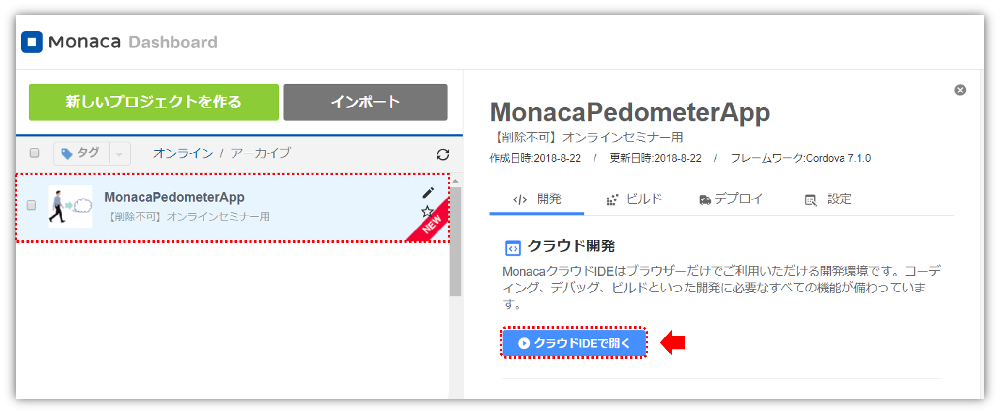

name: inverse
layout: true
class: center, middle, inverse
---
# <span style="font-size: 30%">【Monaca × ニフクラ mobile backend】</span><br>簡単IoT！<br>歩数計アプリを作ろう
富士通クラウドテクノロジーズ株式会社

.right[]

.footnote[
20180912update
]

---
layout: true
class: center, middle, inverse_sub
---
## はじめに

---
layout: false
### 概要
Monaca と ニフクラ mobile backend を使うことで、クラウドにデータを保存し、そのデータをユーザーごとに管理できる機能を備えた「歩数計」アプリが簡単に作成できます。ここではその手順を解説します。

.center[]

---
### Monacaって何？
__もなか 【[Monaca](https://ja.monaca.io/)】__
* HTML5/JavaScript/CSS3でスマホアプリが開発できる開発環境。開発スタイル／コーディング環境は選択可能。

.center[]

---
### ニフクラ mobile backend って何？
__にふくら-もばいる-ばっくえんど 【[ニフクラ mobile backend](https://mbaas.nifcloud.com/about.htm)】__
* スマートフォンアプリに必要なバックエンド機能が開発不要で利用できるクラウドサービス。 クラウド上に用意された機能をAPIで呼び出すだけで利用できます。また、APIを簡単に使うためのSDKを用意しています（ iOS / Android / Monaca / Unity ）。

.center[]

---
### Monaca と mobile backend で<br>サーバー連携アプリは簡単に実現可能に
この２つを組み合わせると、高度なアプリも簡単スピーディーに開発できます

.center[]

.left-column[
__Monaca のすごいところ__
.size_small_7[
* 無料で使える！
* iOS / Android 同時に開発可能！
* いつでもどこでも、ブラウザで開発OK！
* **mobile backendのSDK導入** がクリックだけで簡単に！
]
]
.right-column[
__mobile backend  のすごいところ__
.size_small_7[
* 無料で使える！
* **バックエンドの開発・運用は一切不要**！
* データの保存はたった **３行** で実装可能！
* **コントロールパネル** からクラウドの状況をパッと確認できる！
]
]


---
### 今日体験する内容
#### 歩数計アプリを作ります
端末の加速度センサーにアクセスして歩数を測定、歩数データはクラウドで管理します

1. プロジェクトの準備
    1. 開発環境の準備
    1. mobile backend アプリの作成
    1. Monaca プロジェクトの作成
1. コーディングと解説・動作確認
    1. 進め方について
    1. 会員管理機能<br>（新規登録/ログイン/ログアウト）の実装
    1. 歩数データの保存/更新/取得処理の実装

.right_under[]

---
layout: true
class: center, middle, inverse_sub
---
## 1. プロジェクトの準備

---
layout: false
### 1. 環境の準備
#### 開発環境
登録を完了し、アカウントを作成しておいてください。
* [Monaca](https://monaca.mobi/ja/signup) 利用登録（無料）
* [ニフクラ mobile backend](https://mbaas.nifcloud.com/signup.htm) 利用登録（無料）

#### 動作環境
* PC
 * Chrome 最新版
* 端末 ( iPhone / Android )
 * [Monacaデバッガー](https://ja.monaca.io/debugger.html) 最新版

---
### 2. mobile backend アプリの作成
* mobile backend  にログインします

.center[]
https://mbaas.nifcloud.com/

---
### 2. mobile backend アプリの作成
* 新しいアプリを作成します
* アプリ名は「`pedometer`」と入力してください
* mobile backend を既に使用したことがある場合は、画面上方の<br>  をクリックすると同じ画面が表示されます


.center[]

---
### 2. mobile backend アプリの作成
* アプリが作成されるとAPIキー（２種類）が発行されます
* APIキーは後で使用します。
* ここでは使用しないので、「OK」で閉じます

.center[]

---
### 2. mobile backend アプリの作成
* ダッシュボードが表示されます

.center[]

これでmobile backend （サーバー側）の準備は完了です。

---
### 3. Monaca プロジェクトの作成
* Monacaにログインをします

.center[]

https://ja.monaca.io/

---
### 3. Monaca プロジェクトの作成
#### サンプルプロジェクトのインポート

* プロジェクトをインポートします
  * 下記記リンク先ページを開き「インポート」をクリックします

.center[
.size_large_18[**https://goo.gl/Yvzf2q** ]<br><br>

]

---
### 3. Monaca プロジェクトの作成
#### サンプルプロジェクトのインポート

* プロジェクトがインポートされたら選択し、右側に表示される「クラウドIDEで表示」をクリックします

.center[]


---
### 3. Monaca プロジェクトの作成
* プロジェクトが開かれます

.center[]

---
### 3. Monaca プロジェクトの作成
#### mobile backend  SDK の導入
* 「設定」＞「JS/CSSコンポーネントの追加と削除...」をクリックします
* 「ncmb」と入力して「検索する」をクリックします

.center[]

---
### 3. Monaca プロジェクトの作成
#### mobile backend  SDK の導入
* 「ncmb」が表示されたら「追加」をクリックします
* SDKのバージョンはそのまま（最新）で、「インストール」をクリックします
* 「components/ncmb/ncmb.min.js」にチェックを入れて「保存」をクリックします

.center[]

---
### 3. Monaca プロジェクトの作成
#### mobile backend  SDK の導入
* 一覧に表示されれば導入完了です

.center[]

これで Monaca（アプリ側）の準備も完了です。

---
layout: true
class: center, middle, inverse_sub
---
## 2. コーディングと解説・動作確認

---
layout: false

### 1. 進め方について
* `www/js/app.js`を開きます
* (1)～(7)のコーディングを終えるとアプリが完成する仕組みです

.center[]

---
### 1. 進め方について
前後半に分けて実装と動作確認を行います。

#### 2. 会員管理機能（新規登録/ログイン/ログアウト）の実装
(1) SDKの初期化<br>
(2) 会員の新規登録の処理<br>
(3) 会員のログインの処理<br>
(4) ログアウトの処理<br>
★動作確認①<br>

#### 3. 歩数データの保存/更新/取得処理の実装
(5) クラウド上で歩数を管理する「Steps」クラスを定義する<br>
(6) 歩数データをクラウドと同期させる処理<br>
(7) 歩数データを取得してログイン時に表示する処理<br>
＜おまけ＞加速度センサーから値を取得する処理[実装済み]<br>
★動作確認②

---
### 2. 会員管理機能（新規登録/ログイン/ログアウト）の実装

(1)～(3)をコーディングして「会員登録/ログイン/ログアウト」処理を実装します。

#### (1) SDKの初期化
SDKの初期化は、mobile backend を使用する場合に必ず行う作業です。これによって、アプリがサーバーを認識し、連携されます。

```js
// (1) SDKの初期化
var ncmb = new NCMB('YOUR_APPLICATION_KEY',
                    'YOUR_CLIENT_KEY');
```

---
### 2. 会員管理機能（新規登録/ログイン/ログアウト）の実装
#### (1) SDKの初期化
* mobile backend  のダッシュボードから、APIキー（アプリケーションキーとクライアントキー）をコピーして、それぞれ`YOUR_APPLICATION_KEY`と`YOUR_CLIENT_KEY`に貼り付けます

.center[]

---
### 2. 会員管理機能（新規登録/ログイン/ログアウト）の実装
#### (1) SDKの初期化
* このとき、シングルクォーテーション「`'`」は消さないように注意しましょう

例

```js
// (1) SDKの初期化
var ncmb = new NCMB('bf0f06381a4f36f0537e************************f1e117c5cd7c9f5a9bb4',
                    'c79e730ee0ab59d56a43************************7fb683e51f3543328c90');
```

※一部隠して表記しています。

---
### 2. 会員管理機能（新規登録/ログイン/ログアウト）の実装
#### (2) 会員の新規登録の処理
* 会員管理機能を実装していきます

(2)からは、
```js
/* ここに記入 */
```
の部分を、各処理コードに書き換えることでアプリが完成するようになっています。

---
### 2. 会員管理機能（新規登録/ログイン/ログアウト）の実装
#### (2) 会員の新規登録の処理
* 新規会員登録の処理を実装していきます

.size_small_9[
```js
// Userのインスタンスを生成
var user = new ncmb.User();
// 値を設定
user.set('userName', email)
    .set('password', password);
// 新規登録
user.signUpByAccount()
    .then(function(user){
        /* 新規登録成功時の処理 */
        // ログイン処理
        return ncmb.User.login(user);
    })
    .then(function(user){
        /* ログイン成功時の処理 */
        $('body').trigger('loginComplete');
    })
    .catch(function(err){
        /* 失敗時の処理 */
        $('body').trigger('ncmbError', [err, 'signup']);
    });
```
]

---
### 2. 会員管理機能（新規登録/ログイン/ログアウト）の実装
#### (2) 会員の新規登録の処理
* `new ncmb.User()` ：Userインスタンスを生成
* `.set(key, value)` ：値（ユーザー名とパスワード）の設定
* `.signUpByAccount()` ：新規会員登録処理を実行
* `.then` ：処理に成功したの場合のコールバック
* `.catch` ：処理失敗の場合のコールバック
* 会員登録処理に成功した場合の追加処理
  * `.login(user)` ：会員登録に成功した場合の戻り値である userインスタンス でログイン処理を実行

.size_small_7[
（参考)<br>
ここでは「ユーザー名とパスワード」認証を利用し、ユーザー名としてメールアドレスを使用しています。<br>
実際のメールアドレスを使用した「メールアドレスとパスワード」でのよりセキュアな認証も実装可能です。<br>
詳しくは下記ドキュメントページをご覧ください。<br> [会員管理 \(Monaca\) : メールアドレス認証 \| ニフクラ mobile backend](https://mbaas.nifcloud.com/doc/current/user/authorize_email_monaca.html)
]

---
### 2. 会員管理機能（新規登録/ログイン/ログアウト）の実装
#### (3) 会員のログインの処理
* ログインの処理を実装します

```js
// ログイン
ncmb.User.login(email, password)
         .then(function(user){
           /* ログイン成功時の処理 */
           $('body').trigger('loginComplete');
         })
         .catch(function(err){
           /* ログイン失敗時の処理 */
           $('body').trigger('ncmbError', [err, 'login']);
         });
```
* `.login(userName, password)` ：ユーザー名とパスワードを設定してログイン処理を実行

.size_small_7[
（参考) ログインパターン
* `.login(user)` ：userインスタンス でログイン処理を実行
]


---
### 2. 会員管理機能（新規登録/ログイン/ログアウト）の実装
#### (4) ログアウトの処理
* ログアウト処理そ実装します

```js
// ログアウト
ncmb.User.logout()
         .then(function(){
           /* ログアウト成功時の処理 */
           $('body').trigger('logoutComplete');
         })
         .catch(function(err){
           /* ログアウト失敗時の処理 */
           $('body').trigger('ncmbError', [err, 'logout']);
         });
```
* `.logout()` ：ログアウト処理を実行

---
### 2. 会員管理機能（新規登録/ログイン/ログアウト）の実装

これで会員管理周りの機能実装が完了しました◎

* 編集が完了したら保存を忘れずに！！
 * メニューバーの「ファイル」＞「保存」をクリック
 * Windowsの場合 ：「Ctrl + S」キー
 * Macの場合 ：「Command + S」キー


---
### 2. 会員管理機能（新規登録/ログイン/ログアウト）の実装
#### ★動作確認①
* ここでは簡単のため、Monacaデバッガーは使用せずプレビュー画面をつかって、会員機能の動作確認をしてみましょう

.center[]

---
### 2. 会員管理機能（新規登録/ログイン/ログアウト）の実装
#### ★動作確認①

* 「IDをお持ちでない方」クリックし、メールアドレスとパスワードを入力します
 * メールアドレスは適当なものでOKです。
 * パスワードは6桁以上入力する必要があります。
* 入力後、「新規登録」をクリックすると登録完了し、ログインします

.center[]

---
### 2. 会員管理機能（新規登録/ログイン/ログアウト）の実装
#### ★動作確認①

* mobile backend の管理画面で会員情報が登録されたことを確認しましょう
* 「会員管理」をクリックするとプレビュー画面から登録した会員情報を確認できます

.center[]

---
### 2. 会員管理機能（新規登録/ログイン/ログアウト）の実装
#### ★動作確認①
.left-column[
* 一度ログアウトします
* 画面左上のアイコンをクリックすると、ログアウトできます

]
.right-column[
.center[]

]

---
### 2. 会員管理機能（新規登録/ログイン/ログアウト）の実装
#### ★動作確認①
.left-column[
* 新規会員登録と同様に、メールアドレスとパスワードを入力し「ログイン」ボタンをクリックします
]

.right-column[
.center[]
]

---
### 3. 歩数データの保存/更新/取得処理の実装
ここからは歩数計で測定した「歩数」の記録を、アプリとクラウド間で保存・更新・取得をしていきます。

#### (5) クラウド上で歩数を管理する｢Steps｣クラスを定義する


* 記録の格納用クラス｢Steps｣を作成します

```js
var Steps = ncmb.DataStore('Steps');
```

`Steps` の部分を変更すれば、作成するクラス名を自由に設定することができます。

---
### 3. 歩数データの保存/更新/取得処理の実装
#### (6) 歩数データをクラウドと同期させる処理
このアプリでは「スタート」ボタンをタップして、「ストップ」ボタンをタップするまでの間、歩数をカウントします。「ストップ」ボタンをタップしたときに、歩数と日付のデータをサーバーに格納するように作られています。

.center[]

---
### 3. 歩数データの保存/更新/取得処理の実装
#### (6) 歩数データをクラウドと同期させる処理
* mobile backend にデータを保存（あるいは更新）する処理を実装します

前半

```js
  // 現在ログイン中のユーザー(自分自身)を取得
  var currentUser = ncmb.User.getCurrentUser();
  // ACL(アクセス権限)
  var acl = new ncmb.Acl();
  // 権限を設定(自分だけに読み書き権限を付与)
  acl.setUserReadAccess(currentUser, true)
     .setUserWriteAccess(currentUser, true);
```

つづく

---
### 3. 歩数データの保存/更新/取得処理の実装
#### (6) 歩数データをクラウドと同期させる処理
後半

```js
// Stepsクラスのインスタンスを生成
var steps = new Steps();
// 値を設定
steps.set('objectId', data.objectId)
     .set('date', data.date)
     .set('count', data.count)
     .set('acl', acl);
// save/updateメソッドでクラウド上へ保存/更新する
(!steps.objectId ? steps.save() : steps.update()) // 三項演算子 (条件 ? 真:偽)
  .then(function(obj){
    /* 保存または更新成功時の処理 */
    Pedometer.steps[data.date].objectId = obj.objectId;
    $('body').trigger('syncNext', [waitingList]);
  })
  .catch(function(err){
    /* 保存または更新失敗時の処理 */
    Pedometer.steps[data.date].synced = false;
    $('body').trigger('ncmbError', [err, 'syncCloud']);
    $('body').trigger('syncNext', [waitingList]);
  });
```

---
### 3. 歩数データの保存/更新/取得処理の実装
#### (6) 歩数データをクラウドと同期させる処理
* `ncmb.User.getCurrentUser()` ：ログイン中のユーザー情報を取得
* 参照権限（ACL）の設定
  * `new ncmb.ACL()` ：ACLインスタンスの設定
  * `.setUserReadAccess(user, boolean)` ：特定のユーザーに読み込み権限を設定
  * `.setUserWriteAccess(user, boolean)` ：特定のユーザーに書き込み権限を設定。
* `new Steps()` ：Stepsクラスインスタンスの生成
* `.set(key, value)` ：値（objectId, 日付, 歩数）の設定
* `.save()` ：データの保存処理の実行
* `.update()` ：データの更新処理の実行
  * `(条件 ? 真の場合の処理 : 偽の場合の処理)` ：三項演算子

.size_small_7[
（参考）
* ここでは、データの持ち主本人（currentUser）のみがデータの読み書き可という設定にしています
* 参考演算子を用いることでobjectIdの有無により、保存処理あるいは更新処理をまとめて表記することが可能です
]

---
### 3. 歩数データの保存/更新/取得処理の実装
#### (7) 歩数データを取得してログイン時に表示する処理
* ログイン完了時、mobile backend (サーバー)に当日計測した歩数データがあれば、取得して画面に表示します

.size_small_9[
```js
// 今日の歩数をクラウドから取得してPedometerに設定
Steps.equalTo('date', today)
     .fetchAll()
     .then(function(objects){
       /* 検索成功時の処理 */
       if (objects.length > 0) {
         var currentSteps = {
           count: objects[0].get('count'),
           objectId: objects[0].get('objectId'),
           date: objects[0].get('date')
         };
         // 歩数計に値を設定
         Pedometer.setSteps(currentSteps);
       }
       // 歩数計更新
       Pedometer.refresh();
     })
     .catch(function(err){
       /* 検索失敗時の処理 */
       $('body').trigger('ncmbError', [err, 'loginComplete']);
     });
```
]

---
### 3. 歩数データの保存/更新/取得処理の実装
#### (7) 歩数データを取得してログイン時に表示する処理
* `.equalTo(key, value)` ：keyの値が、valueと一致するデータを指定
* `.fetchAll()` ：全件検索処理の実行
* 取得したデータのオブジェクト操作
  * `object.get(key)` ：取得したobjectからkeyに一致するフィールドの値を取り出す

---
### 3. 歩数データの保存/更新/取得処理の実装
#### ＜おまけ＞加速度センサーから値を取得する処理[実装済み]
端末に備わっている「加速度センサー」の値取得し、歩数を計測しています。Monacaでは簡単に加速度センサーから値を取得することが可能です。

* Cordovaプラグイン
 * Device Motion を有効にします

.center[]

---
### 3. 歩数データの保存/更新/取得処理の実装
#### ＜おまけ＞加速度センサーから値を取得する処理[実装済み]

* 加速度センサーから値を取得する [実装済み]

```js
var watchId = navigator.accelerometer
                       .watchAcceleration(onAcceSuccess, onAcceError, accelerometerOptions);
```

* `onAcceSuccess` ：加速度センサー取得成功時のコールバック
* `onAcceError` ：加速度センサー取得失敗時のコールバック
* `accelerometerOptions` ：加速度センサー取得時の設定

---
### 3. 歩数データの保存/更新/取得処理の実装

これで歩数計周りの機能実装が完了しました◎

* 編集が完了したら保存を忘れずに！！
* メニューバーの「ファイル」＞「保存」をクリック
* Windowsの場合 ：「Ctrl + S」キー
* Macの場合 ：「Command + S」キー

---
### 3. 歩数データの保存/更新/取得処理の実装
#### ★動作確認②
* Monacaデバッガーアプリを起動し、ログインします
* 作成した歩数計アプリを起動します

.center[]


---
### 3. 歩数データの保存/更新/取得処理の実装
#### ★動作確認②
.left-column[
* 起動したらアプリにログインをします
* 動作確認①で作成したアカウントを使いましょう
]
.right-column[
.center[]

]
---
### 3. 歩数データの保存/更新/取得処理の実装
#### ★動作確認②
* 実際に歩数計アプリを使ってみましょう
* 「スタート」ボタンをタップして、測定を開始
 * 歩けない場合は、振っても動作確認が可能です◎

.center[]

---
### 3. 歩数データの保存/更新/取得処理の実装
#### ★動作確認②
* 「ストップ」ボタンをタップして測定を終えます
 * このとき歩数データは mobile backend に保存されます！

.center[]

---
### 3. 歩数データの保存/更新/取得処理の実装
#### ★動作確認②

.size_small_9[
* mobile backend の管理画面（クラウド）を見てみましょう
* 「データストア」をクリックすると、コードで作成した保存先クラス「Steps」が確認できます
* 「Steps」をクリックするとデータを確認できます
]

.center[]

.size_small_9[
* 「acl」の「パーミッション編集」をクリックすると、会員（自分）のobjectIdが確認できます
]


---
### 3. 歩数データの保存/更新/取得処理の実装
#### ★動作確認②

.size_small_9[
* 画面右上の「ゴミ箱」アイコンをタップすると歩数計のカウントを0に戻すことができます
  * 注意：「ゴミ箱」ボタンをタップして、画面のカウントを「0」にリセットしても、再び歩数計をスタートさせ、「ストップ」ボタンをタップしない限り、mobile backend （クラウド）にはデータは反映されません
]

.center[]

.size_small_7[
（参考）
* 一度ログアウトしたあと、もう一度アプリを使ってみましょう。データを検索して、ログイン後すぐに歩数（今日の分）を表示してくれます。
* 「ゴミ箱」ボタンは歩数計作動中にも使用可能です。

]

---
layout: true
class: center, middle, inverse_sub
---
## まとめ

---
layout: false

### まとめ
.size_large_11[
サーバーと連携すれば、<br>アプリはもっといろんなことができることを学んでいただきました
]

* Monacaで簡単に加速度センサーにアクセスできた
* mobile backend との連携で簡単にサーバー連携したアプリが作成できた
 * mobile backend で簡単に会員管理機能を実装できた
 * mobile backend で簡単にデータをクラウドへ保存・更新・取得できた


---
### おわりに
* mobile backend を使えば、

.center[]

.size_small_9[
他にも、
 * mobile backend のプッシュ通知機能を使ってアプリをより便利に！
  * 1日のおわりに、計測した歩数をプッシュ通知でユーザーに報告してみる
  * 歩数が少ないユーザーには励ましのプッシュ通知を送ってみる
]
---
layout: true
class: center, middle, inverse_sub
---
## 参考

---
layout: false

### 完全版について
「(1)SDKの初期化」以外の(2)～(7)の実装を完成させた、完全版jsファイルをご用意しています。以下の２点を実施するだけで直ぐに動作確認いただけます。

* `www/index.html`ファイルの14行目と16行目のコメントアウトを下図のように入れ替える
* `www/js/app.completed.js`の「(1)SDKの初期化」にmobile backend のダッシュボードからコピーしたAPIキーを貼り付ける

.center[]

保存を忘れずに！
