name: inverse
layout: true
class: center, middle, inverse
---
# <span style="font-size: 30%">【Monaca × ニフクラ mobile backend】</span><br>簡単IoT！<br>歩数計アプリを作ろう
富士通クラウドテクノロジーズ株式会社

.right[]

.footnote[
20180912update
]

---
layout: true
class: center, middle, inverse_sub
---
## はじめに

---
layout: false
### 概要
Monacaとニフクラ mobile backendを使うことで、クラウドにデータを保存し、そのデータをユーザーごとに管理できる機能を備えた「歩数計」アプリが簡単に作成できます。ここではその手順を解説します。

.center[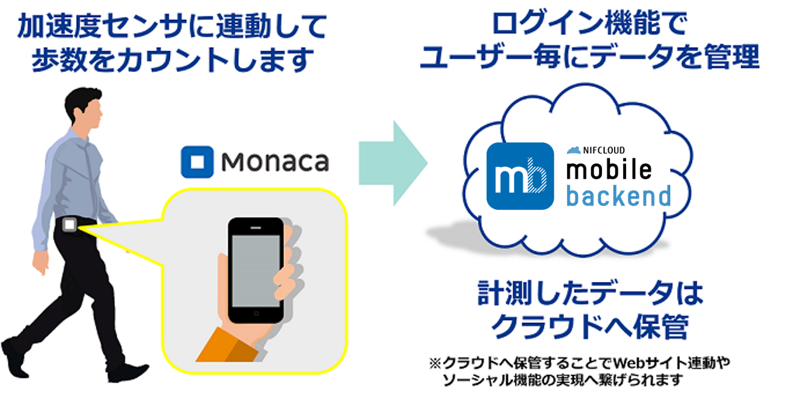]

---
### Monacaって何？
__もなか 【[Monaca](https://ja.monaca.io/)】__
* HTML5/JavaScript/CSS3でスマホアプリが開発できる開発環境。開発スタイル／コーディング環境は選択可能。

.center[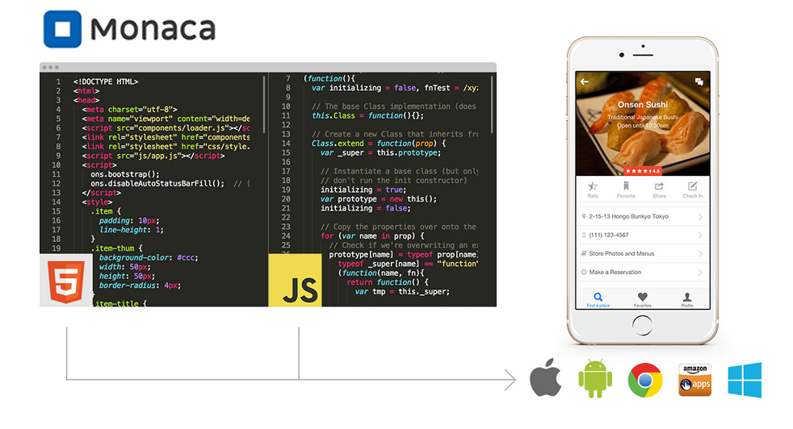]

---
### ニフクラ mobile backend って何？
__にふくら-もばいる-ばっくえんど 【[ニフクラ mobile backend](https://mbaas.nifcloud.com/about.htm)】__
* スマートフォンアプリに必要なバックエンド機能が開発不要で利用できるクラウドサービス。 クラウド上に用意された機能をAPIで呼び出すだけで利用できます。また、APIを簡単に使うためのSDKを用意しています（ iOS / Android / Monaca / Unity ）。

.center[]

---
### Monaca と mobile backend  で<br>サーバー連携アプリは簡単に実現可能に
mobile backend でクラウド連携するといいこといっぱい！

.center[]

---
### 今日体験する内容
#### 歩数計アプリを作ります
端末の加速度センサーにアクセスして歩数を測定、歩数データはクラウドで管理します

1. mobile backend の利用登録とアプリの作成
1. Monaca でアプリを作成
1. Monaca と mobile backend の連携
 * SDK の導入と初期化
 * APIキーの設定
1. 会員管理機能の実装
 * 会員登録/ログイン/ログアウト
1. 歩数データの保存/更新/取得処理の実装

.right_under[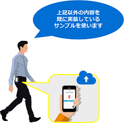]

---
layout: true
class: center, middle, inverse_sub
---
## 準備

---
layout: false
### 事前準備
登録を完了し、アカウントを作成しておいてください。
* [Monaca](https://monaca.mobi/ja/signup) 利用登録（無料）
* [ニフクラ mobile backend](https://mbaas.nifcloud.com/signup.htm) 利用登録（無料）

### 動作環境準備
* PC
 * Chrome 最新版
* 端末 ( iPhone / Android )
 * [Monacaデバッガー](https://ja.monaca.io/debugger.html) 最新版

---
### Monaca準備
* Monacaにログインをします

.center[]

https://ja.monaca.io/

---
### Monaca準備
#### サンプルプロジェクトのインポート

.left-column[
* プロジェクトをインポートします
  * 右記リンク先ページを開き「インポート」をクリックします
* プロジェクトがインポートされたら選択し、右側に表示される「クラウドIDEで表示」をクリックします
]

.right-column[
.size_large_18[**https://goo.gl/Yvzf2q** ]
]

.center[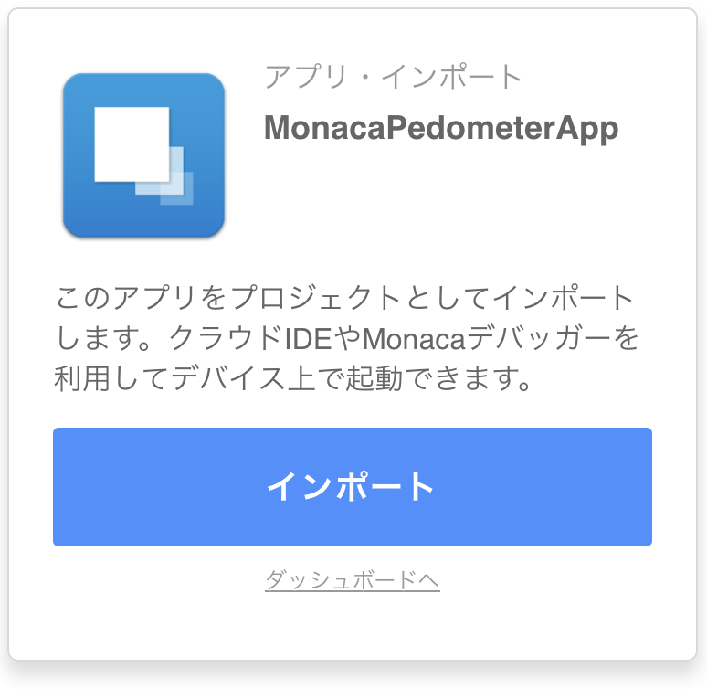]

---
### Monaca準備
* プロジェクトが開かれます

.center[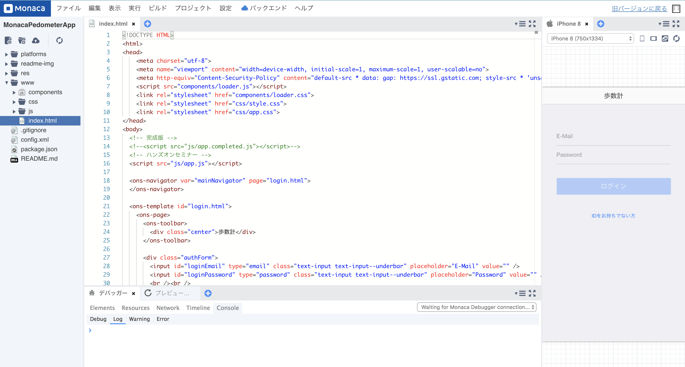]

---
### Monaca準備
#### mobile backend  SDK の導入
* 「設定」＞「JS/CSSコンポーネントの追加と削除...」をクリックします
* 「ncmb」と入力して「検索」をクリックします

.center[]

---
### Monaca準備
#### mobile backend  SDK の導入
* 「ncmb」が表示されたら「追加」をクリックします
* SDKのバージョンは最新（デフォルト）を選択し、「インストール」をクリックします
* 「components/ncmb/ncmb.min.js」にチェックを入れて「保存する」をクリックします

.center[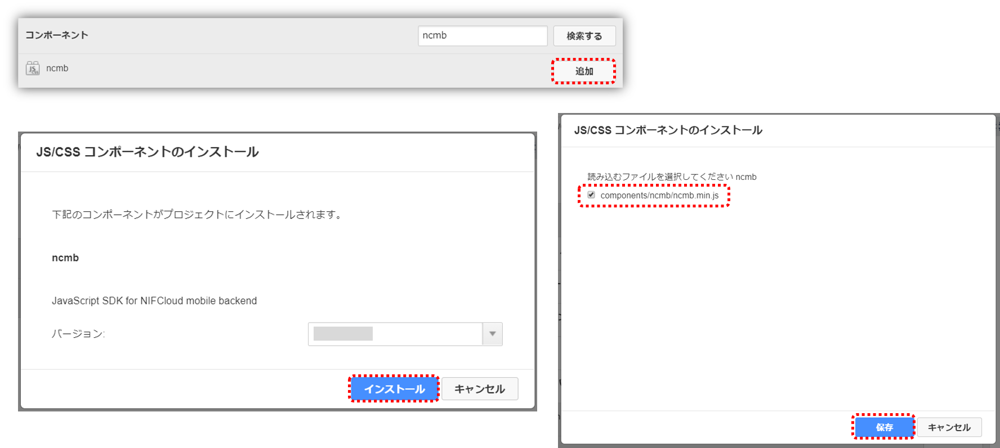]

---
### Monaca準備
#### mobile backend  SDK の導入
* 一覧に表示されれば導入完了です

.center[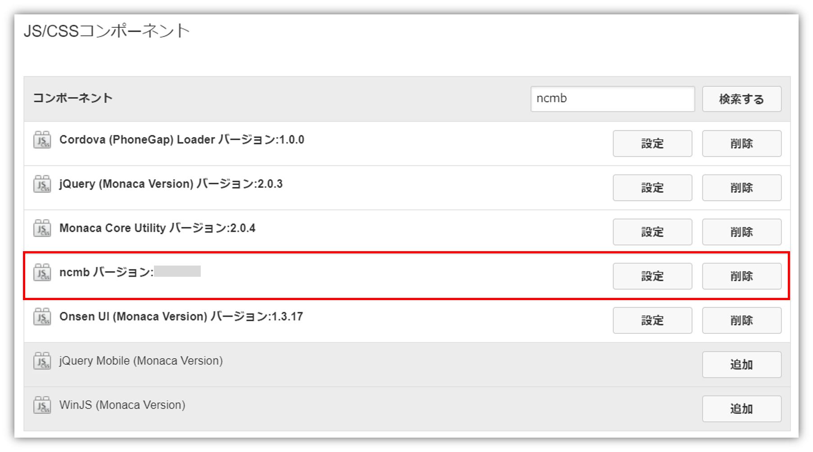]

これでMonaca（アプリ側）の準備は完了です◎

---
### mobile backend 準備
* mobile backend  にログインします

.center[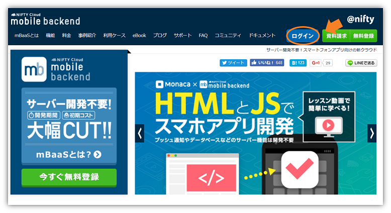]
https://mbaas.nifcloud.com/

---
### mobile backend 準備
* 新しいアプリを作成します
 * アプリ名は「`pedometer`」と入力してください
 * mobile backend を既に使用したことがある場合は、画面上方の<br>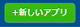  をクリックすると同じ画面が表示されます


.center[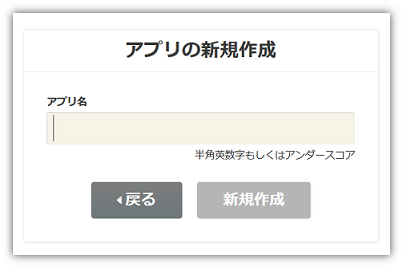]

---
### mobile backend 準備
* アプリが作成されるとAPIキー（２種類）が発行されます
 * APIキーは後で使用します。
* ここでは使用しないので、「OK」で閉じます

.center[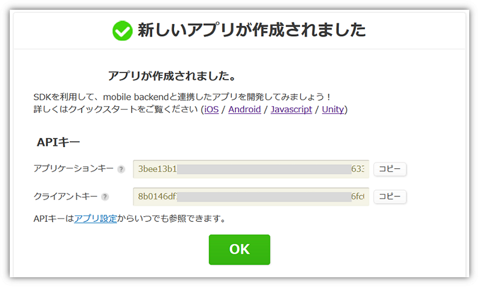]

---
### mobile backend 準備
* ダッシュボードが表示されます

.center[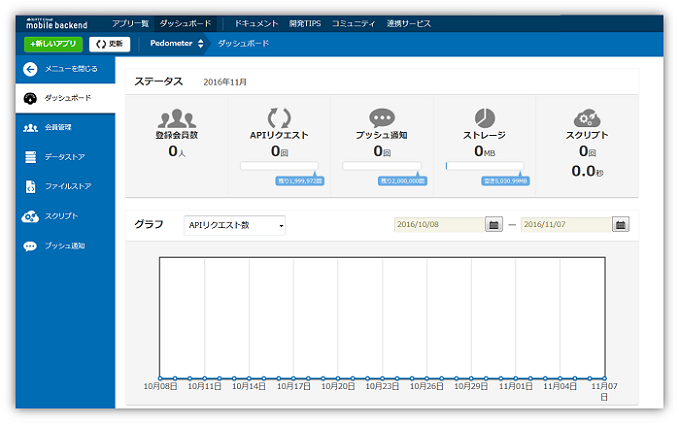]

これでmobile backend （サーバー側）の準備も完了です◎

---
layout: true
class: center, middle, inverse_sub
---
## コーディング手順と解説<br>動作確認の手順

---
layout: false

### コーディング手順と解説動作確認の手順
* `www/js/app.js`を開きます
* (1)～(7)のコーディングを終えるとアプリが完成する仕組みです

.center[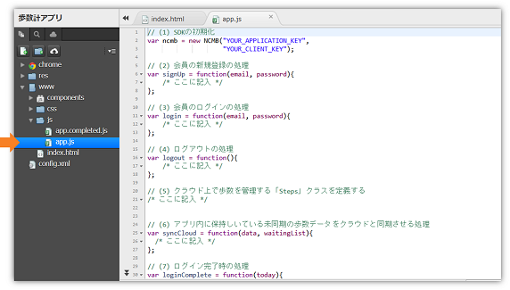]

---
### 目次

(1) SDKの初期化<br>
(2) 会員の新規登録の処理<br>
(3) 会員のログインの処理<br>
(4) ログアウトの処理<br>
★動作確認①<br>

(5) クラウド上で歩数を管理する「Steps」クラスを定義する<br>
(6) 歩数データをクラウドと同期させる処理<br>
(7) 歩数データを取得してログイン時に表示する処理<br>
＜おまけ＞加速度センサーから値を取得する処理[実装済み]<br>
★動作確認②

---
### (1) SDKの初期化
SDKの初期化は、mobile backend を使用する場合に必ず行う作業です。これによって、アプリがサーバーを認識し、連携されます。

```js
// (1) SDKの初期化
var ncmb = new NCMB('YOUR_APPLICATION_KEY',
                    'YOUR_CLIENT_KEY');
```

---
### (1) SDKの初期化
* mobile backend  のダッシュボードから、APIキー（アプリケーションキーとクライアントキー）をコピーして、それぞれ`YOUR_APPLICATION_KEY`と`YOUR_CLIENT_KEY`に貼り付けます

.center[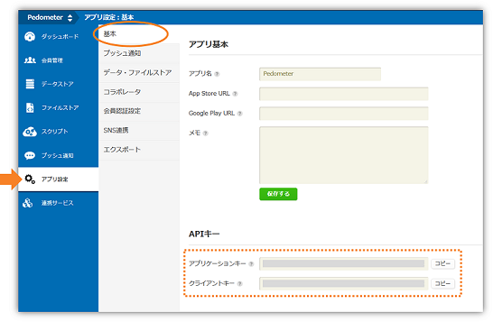]

* このとき、シングルクォーテーション「`'`」は消さないように注意しましょう

---
### (2) 会員の新規登録の処理
ここからは、
```js
/* ここに記入 */
```
の部分を、各処理コードに書き換えることでアプリが完成するようになっています。

---
### (2) 会員の新規登録の処理
* 会員管理機能を実装していきます
* まずは新規会員登録の処理です

.size_small_9[
```js
// (2) 会員の新規登録の処理
var signUp = function(email, password){
  // Userのインスタンスを生成
  var user = new ncmb.User();
  // 値を設定
  user.set('userName', email)
      .set('password', password);
  // 新規登録
  user.signUpByAccount()
      .then(function(user){
          /* 新規登録成功時の処理 */
          // ログイン処理
          return ncmb.User.login(user);
      })
      .then(function(user){
          /* ログイン成功時の処理 */
          $('body').trigger('loginComplete');
      })
      .catch(function(err){
          /* 失敗時の処理 */
          $('body').trigger('ncmbError', [err, 'signup']);
      });
};
```
]

---
### (2) 会員の新規登録の処理
* インスタンスを生成して、`.set(キー, バリュー)`メソッドで値を設定します
 * ここでは「ユーザー名とパスワード」で認証する形式を利用し、ユーザー名としてメールアドレスを使っています。
 * 「メールアドレスとパスワード」での認証も実装可能です。詳しくは[ドキュメントページ](https://mbaas.nifcloud.com/doc/current/user/authorize_email_monaca.html)をご覧ください。
* `.signUpByAccount()`メソッドで登録を実行します
* この後も出てきますが、登録や保存の処理に成功したの場合の処理を、`.then`、処理失敗の場合の処理を、`.catch`で行います。
* 会員登録処理に成功した場合は、`.login(ユーザー)`としてユーザー名とパスワードをもつインスタンスでログインしています。

---
### (3) 会員のログインの処理
* 会員登録をしたら、次はログインの処理を実装します
* (2)と同様に実装できます
 * ただし、ここでは、`.login(ユーザー名, パスワード)`としてユーザー名とパスワードを設定することでログインしています。

```js
// (3) 会員のログインの処理
var login = function(email, password){
  // ログイン
  ncmb.User.login(email, password)
           .then(function(user){
             /* ログイン成功時の処理 */
             $('body').trigger('loginComplete');
           })
           .catch(function(err){
             /* ログイン失敗時の処理 */
             $('body').trigger('ncmbError', [err, 'login']);
           });
};
```

---
### (4) ログアウトの処理
* `.logout()`メソッドでログアウトできます

```js
// (4) ログアウトの処理
var logout = function(){
  // ログアウト
  ncmb.User.logout()
           .then(function(){
             /* ログアウト成功時の処理 */
             $('body').trigger('logoutComplete');
           })
           .catch(function(err){
             /* ログアウト失敗時の処理 */
             $('body').trigger('ncmbError', [err, 'logout']);
           });
};
```
これで会員管理周りの機能実装が完了しました◎

* 編集したら保存を忘れずに！！
 * メニューバーの「保存」をクリックするか、Windowsの場合「Ctrl + S」、Macの場合「Command + S」で保存できます。

---
### ★動作確認①
* プレビュー画面をつかって、会員機能（会員登録、ログイン、ログアウト）の動作確認をしてみましょう
 * ここでは簡単のため、Monacaデバッガーは使用せず動作確認を行います。

.center[]

---
### ★動作確認①
#### 会員登録
* 「IDをお持ちでない方」タップし、メールアドレスとパスワードを入力します
 * メールアドレスは適当なものでOKです。
 * パスワードは6桁以上入力する必要があります。
* 入力後、「新規登録」をタップすると登録完了し、ログインします

.center[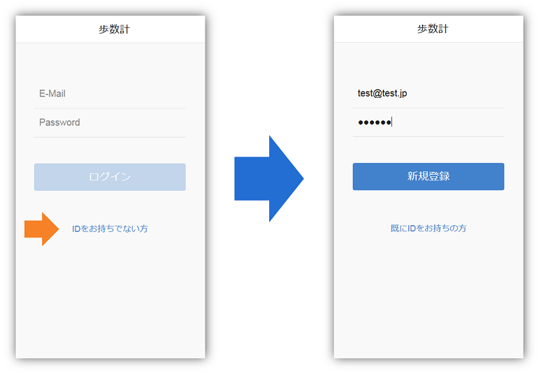]

---
### ★動作確認①
#### ダッシュボードで登録されたことを確認
* mobile backend のダッシュボード（クラウド）を見てみましょう
* 「会員管理」をクリックすると先ほど端末から登録したアカウントを確認できます

.center[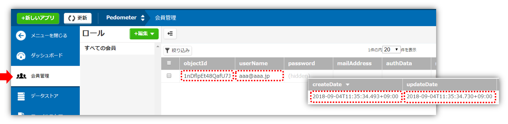]

---
### ★動作確認①
.left-column[
#### ログアウト
* ログインの確認をする前に、一度ログアウトしておきましょう
* 画面左上のアイコンをタップすると、ログアウトできます
* ログアウトで、mobile backend 上の会員データのupdateDate が更新されます
]
.right-column[
.center[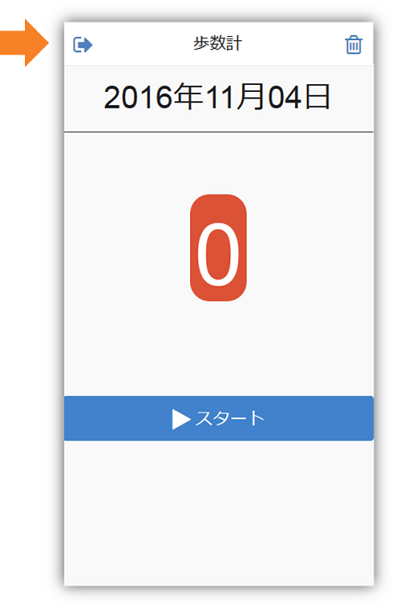]
]

---
### ★動作確認①
.left-column[
#### ログイン
* 会員登録と同様に、アドレスとパスワードを入力し、「ログイン」ボタンをタップします
* ログインでも同様に、mobile backend 上の会員データのupdateDate が更新されます
]
.right-column[
.center[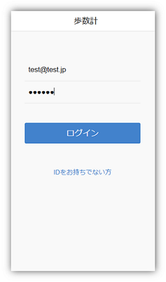]
]

---
### (5) クラウド上で歩数を管理する｢Steps｣クラスを定義する
次は歩数計で測定した「歩数」の記録を、アプリとクラウド間で保存・更新・取得をしていきます。

* 記録の格納用クラスを作成します

```js
// (5) クラウド上で歩数を管理する「Steps」クラスを定義する
var Steps = ncmb.DataStore('Steps');
```

* 「`Steps`」の部分を変更すれば、作成するクラス名を自由に設定することができます。

---
### (6) 歩数データをクラウドと同期させる処理
このアプリでは、「スタート」ボタンをタップして、「ストップ」ボタンをタップするまでの間、歩数をカウントします。「ストップ」ボタンをタップしたときに、歩数と日付のデータをサーバーに格納するように作られています。

.center[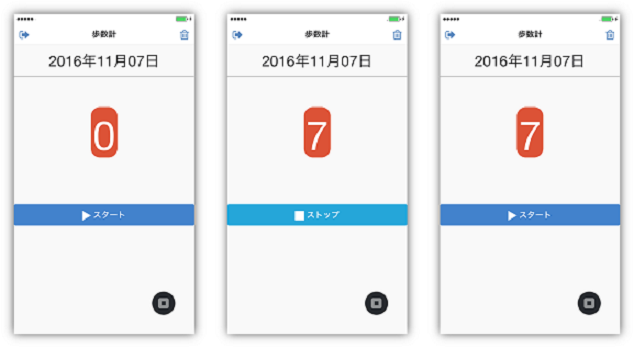]

---
### (6) 歩数データをクラウドと同期させる処理
* mobile backend にデータを保存（あるいは更新）する処理を実装します

```js
// (6) アプリ内に保持しいている未同期の歩数データをクラウドと同期させる処理
var syncCloud = function(data, waitingList){
  // 現在ログイン中のユーザー(自分自身)を取得
  var currentUser = ncmb.User.getCurrentUser();
  // ACL(アクセス権限)
  var acl = new ncmb.Acl();
  // 権限を設定(自分だけに読み書き権限を付与)
  acl.setUserReadAccess(currentUser, true)
     .setUserWriteAccess(currentUser, true);

```
つづく
---
### (6) 歩数データをクラウドと同期させる処理
* mobile backend にデータを保存（あるいは更新）する処理を実装します

```js
  // Stepsクラスのインスタンスを生成
  var steps = new Steps();
  // 値を設定
  steps.set('objectId', data.objectId)
       .set('date', data.date)
       .set('count', data.count)
       .set('acl', acl);
  // save/updateメソッドでクラウド上へ保存/更新する
  (!steps.objectId ? steps.save() : steps.update()) // 三項演算子 (条件 ? 真:偽)
    .then(function(obj){
      /* 保存または更新成功時の処理 */
      Pedometer.steps[data.date].objectId = obj.objectId;
      $('body').trigger('syncNext', [waitingList]);
    })
    .catch(function(err){
      /* 保存または更新失敗時の処理 */
      Pedometer.steps[data.date].synced = false;
      $('body').trigger('ncmbError', [err, 'syncCloud']);
      $('body').trigger('syncNext', [waitingList]);
    });
};
```

---
### (6) 歩数データをクラウドと同期させる処理
* 保存するデータには参照権限（ACL）を設定することが可能です
 * ここでは、会員管理ユーザーと紐付けて、データの持ち主本人（currentUser）のみがデータの読み書き可という設定にしています。
* 読み込み権限：`.setUserReadAccess（ユーザー, 真偽値）`、書き込み権限：`.setUserWriteAccess（ユーザー, 真偽値）`出設定できます
* 保存も更新も、同様に`.set(キー, バリュー)`メソッドで値を設定します
* その後、保存の場合は`save()`メソッド、`update()`メソッドを実行して処理を行います
 * ここでは三項演算子を用いて、保存の場合と更新の場合をまとめて表記しています

---
### (7) 歩数データを取得してログイン時に表示する処理
* ログイン完了時、mobile backend (サーバー)に当日計測した歩数データがあれば、取得して画面に表示します

.size_small_9[
```js
// (7) 歩数データを取得してログイン時に表示する処理
var loginComplete = function(today){
  // 今日の歩数をクラウドから取得してPedometerに設定
  Steps.equalTo('date', today)
       .fetchAll()
       .then(function(objects){
         /* 検索成功時の処理 */
         if (objects.length > 0) {
           var currentSteps = {
             count: objects[0].get('count'),
             objectId: objects[0].get('objectId'),
             date: objects[0].get('date')
           };
           // 歩数計に値を設定
           Pedometer.setSteps(currentSteps);
         }
         // 歩数計更新
         Pedometer.refresh();
       })
       .catch(function(err){
         /* 検索失敗時の処理 */
         $('body').trigger('ncmbError', [err, 'loginComplete']);
       });
};
```
]

---
### (7) 歩数データを取得してログイン時に表示する処理
* データの取得のため、検索を行います
* `.equalTo(キー, バリュー)`メソッドで「キー」の値が、「バリュー」と一致するデータを指定し、`.fetchAll()`メソッドで全件検索を行います
* 取得した値から各キーの値を取り出すには、`.get(キー)`メソッドを使用します

* 編集したら保存を忘れずに！！
 * メニューバーの「保存」をクリックするか、Windowsの場合「Ctrl + S」、Macの場合「Command + S」で保存できます。


---
### ＜おまけ＞<br>加速度センサーから値を取得する処理[実装済み]
端末に備わっている「加速度センサー」の値取得し、歩数を計測しています。Monacaでは簡単に加速度センサーから値を取得することが可能です。使い方に関しては、後ほど触れますが、実装済みの内容をここで示しておきます。

* Cordovaプラグイン
 * Device Motion を有効にします

.center[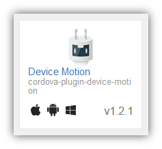]

---
### ＜おまけ＞<br>加速度センサーから値を取得する処理[実装済み]

* 加速度センサーから値を取得

```js
var watchId = navigator.accelerometer
                       .watchAcceleration(onAcceSuccess, onAcceError, accelerometerOptions);
```

* `onAcceSuccess`
 * 加速度センサー取得成功時のコールバック
* `onAcceError`
 * 加速度センサー取得失敗時のコールバック
* `accelerometerOptions`
 * 加速度センサー取得時の設定

---
### ★動作確認②
#### Monacaデバッガー動作確認をしてみましょう
* Monacaデバッガーアプリを起動し、ログインしてください
* 作成した歩数計アプリを起動します

.center[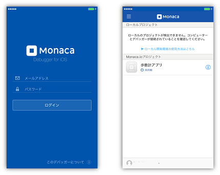]

---
### ★動作確認②
.left-column[
* 起動したらアプリにログインをしてください
 * 動作確認①で作成したアカウントを使います
]
.right-column[
.center[]
]
---
### ★動作確認②
* 実際に歩数計を使ってみましょう
* 「スタート」ボタンをタップして、測定を開始
 * 歩けない場合は、振っても動作確認が可能です◎

.center[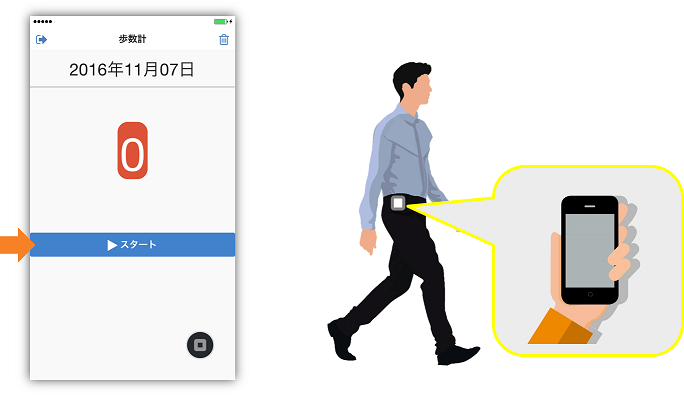]

---
### ★動作確認②
* 「ストップ」ボタンをタップして測定を終えます
 * このときデータがmobile backend に保存されます！

.center[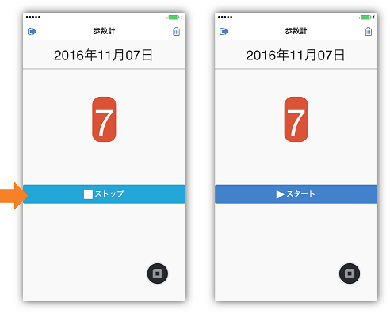]

---
### ★動作確認②
#### ダッシュボードで登録されたことを確認
* mobile backend のダッシュボード（クラウド）を見てみましょう
* 「データストア」をクリックすると、コードで作成した保存先クラス「Steps」が確認できます
* 「Steps」をクリックするとデータを確認できます

.center[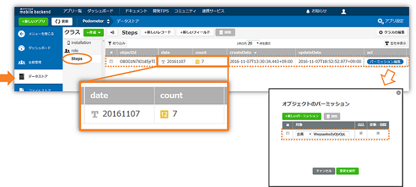]

---
### ★動作確認②
#### ダッシュボードで登録されたことを確認
* 「acl」の「パーミッション編集」をクリックすると、会員（自分）のobjectIdが確認できます
 * この場合は、会員自身のみがデータにアクセスすることができます。

#### 一度ログアウトしたあと、もう一度アプリを使ってみよう！
* データを検索して、ログイン後すぐに歩数（今日の分）を表示してくれます

---
### ★動作確認②
#### カウントを0に戻すには？？
* 画面右上の「ゴミ箱」アイコンをタップすると歩数計のカウントを0に戻すことができます
 * 「ゴミ箱」ボタンは歩数計作動中にも使用することができます。
 * ただし、「ゴミ箱」ボタンをタップして、画面のカウントを「0」にリセットしても、再び歩数計をスタートさせ、「ストップ」ボタンをタップしない限り、mobile backend （クラウド）にはデータは反映されません。
* mobile backend （クラウド）上に正しく反映されるか、確認してみましょう

.center[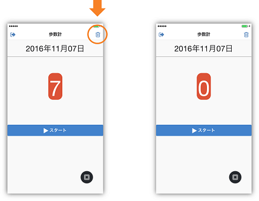]


---
layout: true
class: center, middle, inverse_sub
---
## まとめ

---
layout: false

### まとめ
.size_large[
* Monacaで簡単に加速度センサーにアクセスできることがわかった
* mobile backend との連携で簡単にサーバー連携したアプリが作成できることがわかった
 * mobile backend で簡単に会員管理機能を実装できた
 * mobile backend で簡単にデータをクラウドへ保存・更新・取得がでることがわかった
* サーバーと連携すれば、アプリはもっといろんなことができることがわかった！！
]

---
### おわりに
* mobile backend を使えば、

.center[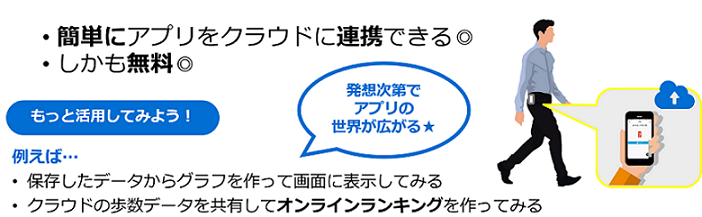]

.size_small_9[
他にも、
 * mobile backend のプッシュ通知機能を使ってアプリをより便利に！
  * 1日のおわりに、計測した歩数をプッシュ通知でユーザーに報告してみる
  * 歩数が少ないユーザーには励ましのプッシュ通知を送ってみる
]
---
layout: true
class: center, middle, inverse_sub
---
## 参考

---
layout: false

### 5分で体験会バージョン
「(1)SDKの初期化」以外の実装を完成させた、『5分で体験会バージョン』をご用意しています。以下の２点を実施するだけで直ぐに動作確認いただけます。

* `www/index.html`ファイルの14行目と16行目のコメントアウトを下図のように入れ替えてください。
* `www/js/app.completed.js`の「(1)SDKの初期化」にmobile backend のダッシュボードからコピーしたAPIキーを貼り付けてください。

.center[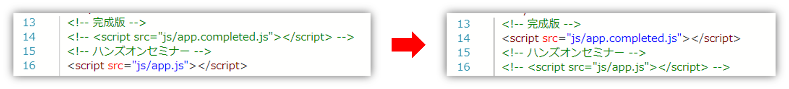]
